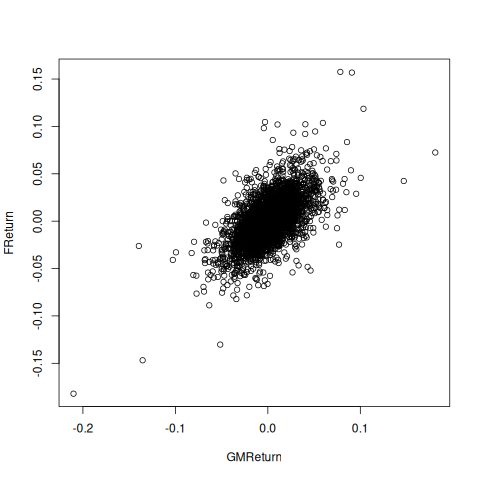
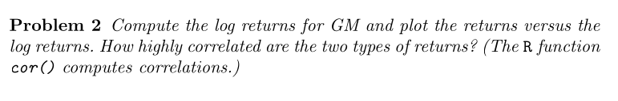
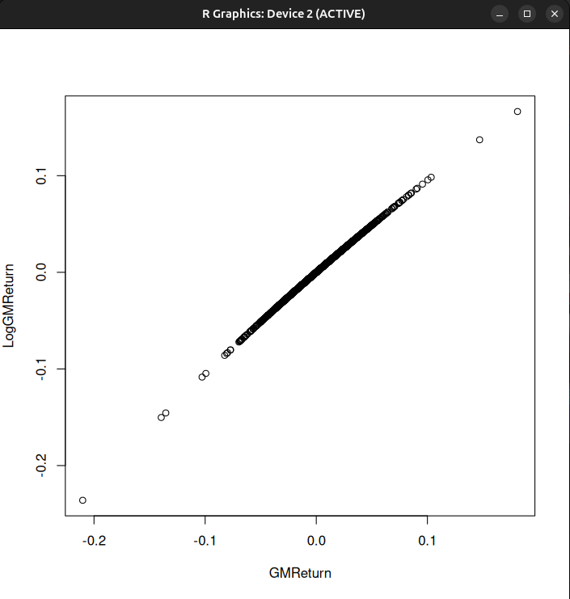
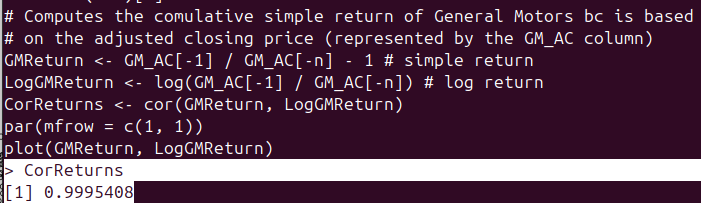
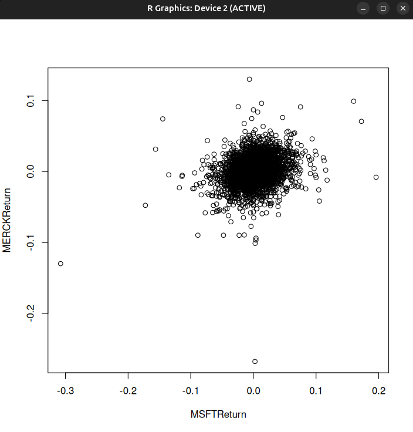
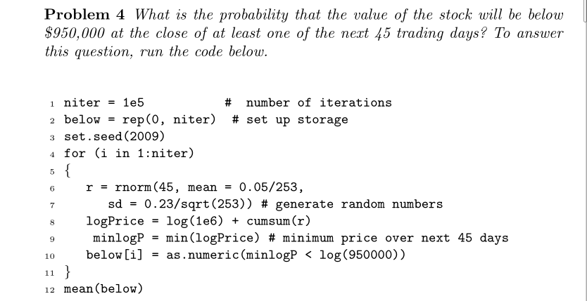
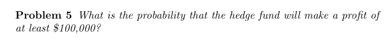
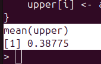
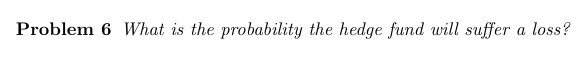
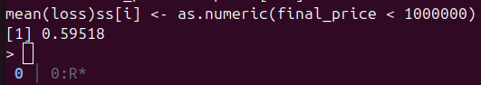

# Finance Engineering
*Solving problems in quantitative finance with statistics and applied math*

**Problem 1**: *Analysis of General Motors and Ford returns*

**Solution**:
> The `problem1.R` program will read the dataset `Stock_bond.csv` containing daily volumes, adjusted closing (AC) prices of stocks and the S&P 500 (columns B–W), and yields on bonds (columns X–AD) from January 2, 1987, to September 1, 2006. It will then plot the returns of General Motors and Ford and seek to answer questions about the correlation between the two. The graph plotting both returns is shown below (the answer for problem 1 is true for all three questions):

**Problem 2**: *Log Returns vs Simple Returns and their correlations*

**Solution**:
> Logarithm return vs. Simple Return of General Motors:

> That's trivial in R because the native function `cor()` calculates the correlation between the two returns.
> If correlation is equal to one, then the two assets have a positive correlation, meaning that holding both assets provides no hedging benefit. You can see that the log return of GM is very correlated to the simple return of GM, as `cor(GMReturn, LogGMReturn) = 0.995408`:

**Problem 3**: *Analysis of Microsoft and Merck returns (like Problem 1)*

**Solution**:
> Just as with Problem 1, we plot the returns without difficulty. Regarding the possible correlation between the Microsoft and Merck returns, there is some correlation between them; however, we have some positive outliers in Merck returns that are negatively correlated with the Microsoft returns of the same period, such as a point at coordinates ~ (0.1) for MSFT and ~ (-0.15) for MRK.

# Simulations
Hedge funds can earn high profits through the use of leverage, but leverage also creates high risk. The simulations in this section explore the effects of leverage in a simplified setting.

Suppose a hedge fund owns $1,000,000 of stock and used $50,000 of its own capital and $950,000 in borrowed money for the purchase. Suppose that if the value of the stock falls below $950,000 at the end of any trading day, then the hedge fund will sell all the stock and repay the loan. This will wipe out its $50,000 investment. The hedge fund is said to be leveraged 20:1 since its position is 20 times the amount of its own capital invested.

Suppose that the daily log returns on the stock have a mean of 0.05/year and a standard deviation of 0.23/year. These can be converted to rates per trading day by dividing by 253 and sqrt(253), respectively.

**Problem 4**: *Simulating the risk of a hedge fund leveraged position*

**Solution**:
> The `problem4.R` script simulates daily stock price paths utilizing a random walk model derived from the annualized parameters scaled down to daily trading intervals. By tracking the daily valuation of the portfolio, the simulation calculates the likelihood that the stock falls below the $950,000 margin threshold, triggering a forced liquidation and a complete loss of the $50,000 capital investment. In the `problem4.R` code you will see more comments explaining every line of code.

> When this code runs we get `mean(below) == 0,50988` which is roughly 51%. This means that for the 100,000 simulated paths about 51,000 of them experienced a dip below $950.000 at some point during the 45 days window. This means there is over a 50% chance (essentially a coin flip) that the leveraged position will hit the liquidation threshold and completely wipe out the $50,000 equity within just two months. It vividly demonstrates why high leverage (20:1) combined with a 23% annual volatility makes this an extremely high-risk strategy.

Suppose now that the hedge fund will sell the stock for a profit of at least $100,000 if the value of the stock rises to at least $1,100,000 at the end of the one at the first 100 trading days, sell it for a loss if the value falls below $950,00 at the end of one of the first 100 trading days, or sell after 100 trading days if the closing price has stayed between $950,000 and $1,100,000. Ignore trading costs and interest when answering theses questions.

**Problem 5**: *Probability of profit*

**Solution**:
> The `problem5.R` program will simulate the variation of the asset price in 100 days, and we select all days where the thresholds are crossed then we apply an `if` condition to filter the first day each barrier is hit ,then we calculate the mean of the results of the 100,000 simulations we run and arrive at the conclusion that the hedge fund will make a profit of at least $100,000 with probability of 0.38775 ~ 39%.

**Problem 6**: *Probability of loss*

**Solution**:
> The `problem6.R` differs from `problem5.R` in the filter applied by the `if` and `else if` in the final part of the script. After finding the first day that each barrier is hit, we then determine if a loss has occured (we reach the lower barrier and sold the asset below $950,000) we assign 1 to the `loss` vector, otherwise then we assign 0 to the loss vector (the upper barrier was hit before lower barrier, so we sold the asset gaining a profit), or if the price stays between $950,000 and $1,000,000 we sold the asset in the last day and check if the final price was less than what we begin `final_price <- price[100]` `loss[i] <- as.numeric(final_price<1000000)` then we take the mean of all the losses results from the ***Monte Carlo Simulation***

