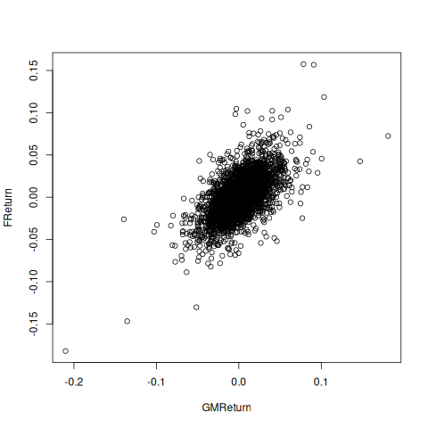
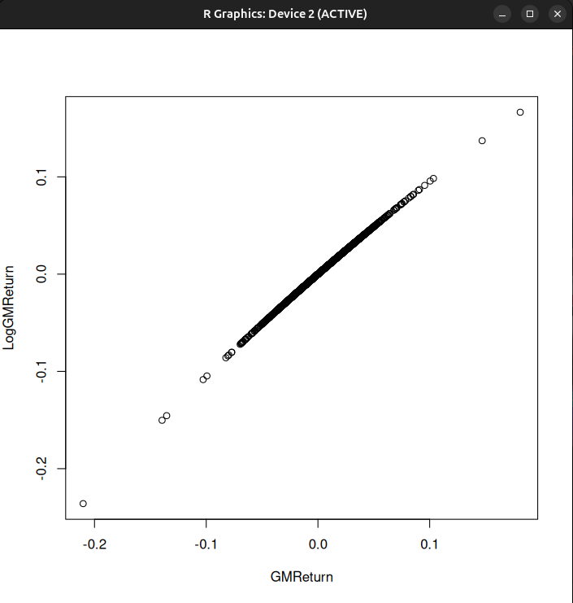
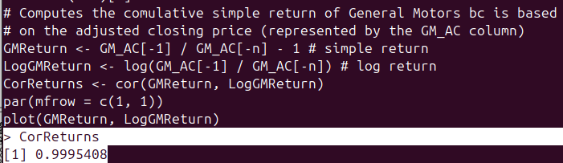
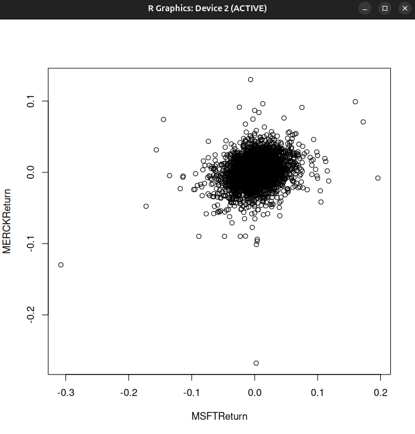

# Quantitative Finance & Applied Statistics
*Solving problems in financial econometrics and statistical arbitrage through mathematical modeling and R.*

---

## Part I: Equity Return Analysis & Correlation

**Dataset Overview:** The underlying dataset (`Stock_bond.csv`) contains daily volumes, adjusted closing (AC) prices of stocks and the S&P 500, as well as bond yields, spanning from January 2, 1987, to September 1, 2006.

### Problem 1: Return Dynamics of General Motors and Ford
> **Objective:** Analyze the historical daily returns of GM and Ford to identify statistical correlations.

**Mathematical Formulation:**
The simple return $R_t$ at time $t$ is given by the ratio of prices $P$:

$$R_t = \frac{P_t - P_{t-1}}{P_{t-1}}$$

**Implementation & Results:**
The `problem1.R` script reads the historical data and plots the returns. Visual inspection of the graph below demonstrates the volatility clustering and correlation structure between the two automakers across the evaluated decades.

### Problem 2: Log Returns vs. Simple Returns
> **Objective:** Compare the statistical behavior of logarithmic returns and simple returns for General Motors.

**Mathematical Formulation:**
The logarithmic (continuously compounded) return $r_t$ is defined as:

$$r_t = \ln\left(\frac{P_t}{P_{t-1}}\right) = \ln(1 + R_t)$$

Using the Taylor series expansion for $\ln(1 + x) \approx x$ for small $x$, we expect $r_t \approx R_t$ for small daily variations. 

**Implementation & Results:**
This theoretical approximation holds empirically. Calculating the Pearson correlation coefficient via the native `cor()` function in R yields a nearly perfect linear relationship: `cor(GMReturn, LogGMReturn) = 0.995408`. Because this correlation is essentially $1$, holding positions based on opposite return metrics provides zero hedging benefit.

### Problem 3: Outlier Analysis in Microsoft and Merck
> **Objective:** Evaluate correlations and identify structural breaks or isolated outliers between MSFT and MRK.

**Implementation & Results:**
While a general baseline correlation exists, the scatter plot reveals distinct positive outliers in Merck's returns that are negatively correlated with Microsoft during the same period. For instance, a notable divergence occurs at coordinates roughly equivalent to $(0.1)$ for MSFT and $(-0.15)$ for MRK.

---

## Part II: Monte Carlo Simulations & Leverage Risk

Hedge funds frequently exploit statistical edges through leverage, which amplifies both expected returns and downside risk. This section simulates a highly leveraged portfolio to assess the probability of ruin and expected payoffs.

**Portfolio Parameters:**
*   **Total Position:** $1,000,000
*   **Capital Structure:** $50,000 equity (own capital) + $950,000 debt (borrowed).
*   **Leverage Ratio:** 20:1 (Position is 20x the equity).
*   **Margin Call / Ruin:** Liquidation occurs if the portfolio value falls below $950,000, wiping out the $50,000 equity.

**Stochastic Model:**
We model the daily log returns assuming a discrete-time approximation of Geometric Brownian Motion, where $r_t \sim \mathcal{N}(\mu_{daily}, \sigma_{daily}^2)$. 
Given an annualized mean $\mu = 0.05$ and annualized volatility $\sigma = 0.23$, the daily parameters (assuming 253 trading days) are:

$$\mu_{daily} = \frac{0.05}{253}, \quad \sigma_{daily} = \frac{0.23}{\sqrt{253}}$$

### Problem 4: Probability of Ruin (Margin Call)
> **Objective:** Simulate the risk of a margin call over a 45-day window.

**Implementation & Results:**
The `problem4.R` script executes a Monte Carlo simulation generating 100,000 price paths using a random walk model. The script tracks daily valuations to check if the portfolio breaches the lower barrier ($\le \$950,000$). 

The output yields `mean(below) == 0.50988`. This indicates that out of 100,000 simulated paths, approximately 51% experienced a drawdown below the margin threshold. A 20:1 leverage ratio combined with a 23% annual volatility creates essentially a coin-flip probability of total ruin within just 45 days.

### Problems 5, 6 & 7: Barrier Options & Expected Profit
> **Objective:** Calculate the probabilities of specific path-dependent outcomes and the expected value of the portfolio over a 100-day window, introducing an upper take-profit barrier.

**Trading Rules:**
1.  **Take-Profit:** Sell if $P_t \ge \$1,100,000$ (Profit $\ge \$100,000$).
2.  **Stop-Loss:** Sell if $P_t \le \$950,000$ (Loss of $50,000).
3.  **Expiration:** Sell at $t = 100$ if neither barrier is breached.

We can define the stopping times for our barriers as:

$$\tau_A = \inf\{t \le 100 : P_t \le 950,000\}$$
$$\tau_B = \inf\{t \le 100 : P_t \ge 1,100,000\}$$

**Results:**
*   **Probability of Profit (Problem 5):** `problem5.R` filters paths where $\tau_B < \tau_A$. The simulation yields a probability of `0.38775` ($\sim 39\%$) of securing at least $100,000 in profit.
*   **Probability of Loss (Problem 6):** `problem6.R` identifies paths where the stop-loss is triggered ($\tau_A < \tau_B$) OR the expiration price $P_{100} < \$1,000,000$. The probability of realizing a loss is `0.59518` ($\sim 59\%$).

**Expected Profit Calculation (Problem 7):**
Let $X$ be the final profit. We partition the sample space into three mutually exclusive events based on our stopping times:
*   **Event A (Ruin):** Lower barrier hit first. $\text{Profit} \mid A = -\$50,000$
*   **Event B (Success):** Upper barrier hit first. $\text{Profit} \mid B = P_{\tau_B} - \$1,000,000$
*   **Event C (Expiration):** No barrier hit. $\text{Profit} \mid C = P_{100} - \$1,000,000$

By the Law of Total Expectation, the overall expected profit is:

$$\mathbb{E}[X] = (-\$50,000) P(A) + \mathbb{E}[P_{\tau_B} - \$1,000,000 \mid B] P(B) + \mathbb{E}[P_{100} - \$1,000,000 \mid C] P(C)$$
